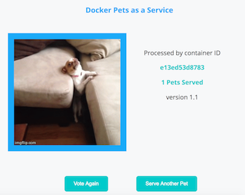

#Use PaaS to Demo Docker Datacenter
> written for `chrch/paas:1.1`

1) Create a secret for the Admin Console access in the app. Adjust the [pets-prod-compose.yml](https://github.com/mark-church/pets/blob/master/pets-prod-compose.yml) file so that it matches the name of your secret. The default in the compose file is `ADMIN_PASSWORD_FILE=/run/secrets/admin_password`. Feel free to use UCP labels to demonstrate RBAC features.

 

2) Deploy [pets-prod-compose.yml](https://github.com/mark-church/pets/blob/master/pets-prod-compose.yml) in UCP as a Docker stack.

3) Check the stack's service status and the logs for `paas_web`. It will take up to 30 seconds for the app to become operational.

 

3) If DNS and HRM are configured correctly you can access on the configured URL or the ephemeral port chosen by UCP.

 

4) Access the PaaS client page. Input your name and vote for a specific animal.

 

3) Reload the page to serve new animals by pressing `Serve Another Pet`. See that you are being load balanced between multiple containers.

 

4) Scale the application by changing the replicas parameter for the `paas_web` service. Now see that the number of containers that are being load balanced to has increased.

 

5) Check that the application health check is working by going to `/health`.

 

6) Toggle the health check to be unhealthy by going to `/kill`. Now return to the web browser to see that one of the containers has toggled to unhealthy. Continue to refresh. The container will be killed and rescheduled by Swarm.

 

7) Log in to the admin console using the URL or port exposed by UCP. Use the secret password specified in Step 1.

 

8) View the votes.

 

