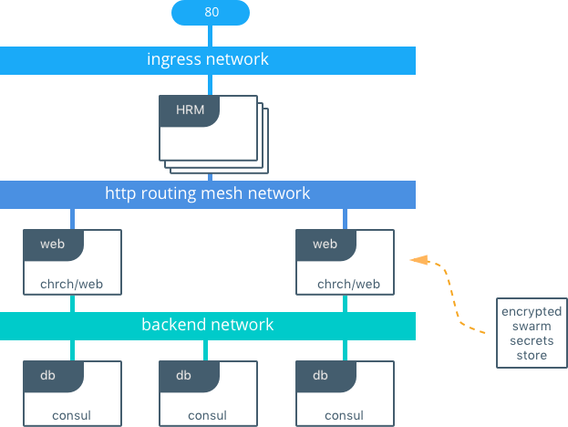
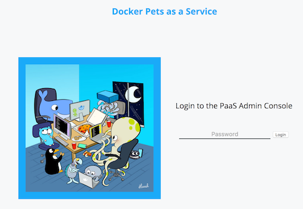
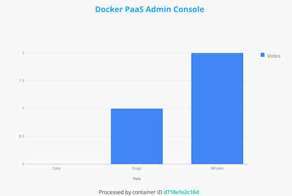

#Docker Pets as a Service
PaaS is a simple application that's useful for testing out features of Docker Datacenter.

If you are interested in contributing to Docker PaaS please check out the [Release Notes & Roadmap.](https://github.com/mark-church/docker-paas/blob/master/ROADMAP.md).

PaaS is comprised of two images:

- `chrch/paas` is a front-end Python Flask container that serves up random images of housepets, depending on the given configuration
- `consul` is a back-end KV store that stores the number of visits that the `web` services recieve. It's configured to bootstrap itself with 3 replicas so that we have fault tolerant persistence.

###Running PaaS as a Single Contianer, Stateless App
```
$ docker run -it -p 5000:5000 chrch/paas
```


###Running PaaS on Docker for Mac/Windows in Development
Docker Swarm can easily be set up to run applications on a single developer laptop. The full app can be brought up to run in the same way it would run in production. We use a compose v3 file to deploy a fully fault tolerant frontend and backend, along with the configurations, secrets, and networks required for the application to run.

This is the full architecture that is deployed when using [pets-dev-compose.yml](https://github.com/mark-church/pets/blob/master/pets-dev-compose.yml).

```
$ git clone https://github.com/mark-church/docker-paas

~/docker-paas$ docker -v
Docker version 1.13.1-rc1, build 2527cfc

~/docker-paas$ docker node ls
ID                           HOSTNAME  STATUS  AVAILABILITY  MANAGER STATUS
fd3ovikiq7tzmdr70zukbsgbs *  moby      Ready   Active        Leader

~/docker-paas$ docker stack deploy -c pets-dev-compose.yml paas
```

 


###PaaS configuration parameters
The `web` container has several configuration parameters as environment variables:


- **`DB`**: Tells `web` where to find `db`. Service name or `<ip>:<port>`.
- **`DEBUG`**: Puts `web` containers in to debug mode. When mounting a volume for code, they will restart automatically when they detect a change in the code. Defaults to off, set to `True` to turn on.
- **`ADMIN_PASSWORD_FILE`**: Turns secrets on. If set, will password protect the Admin Console of `web`. Set to the full location of the Swarm secret (`/run/secrets/< X >`)

####Services
- Client web access - `5000/`, voting interface
- Admin / results UI - port `7000/`
- Consul UI - `8500/ui`

####Voting Option Configuration

- **`OPTION_A`**: Defaults to 'Cats'. Pictures located in `/docker-paas/web/static/option_a`
- **`OPTION_B`**: Defaults to 'Dogs'. Pictures located in `/docker-paas/web/static/option_b`
- **`OPTION_C`**: Defaults to 'Whales'. Pictures located in `/docker-paas/web/static/option_c`


###Running PaaS on Docker UCP in Production
Production apps have entirely different requirements when it comes to security, deployment, and also security. Fortunately, deployment on Swarm & UCP is very much the same from development to production. Some minor additions to our compose file add in capabilities for secrets and also for L7 load balancing.

This is the full architecture that is deployed when using [pets-prod-compose.yml](https://github.com/mark-church/pets/blob/master/pets-prod-compose.yml).

```
$ echo `mysecret` | docker secret create admin_password_v1 -
$ docker stack deploy -c pets-prod-compose.yml paas
```

 

###Using PaaS

####Client Voting
 


####Admin Console Login (with secrets)
 


####Admin Console Results Page
 


